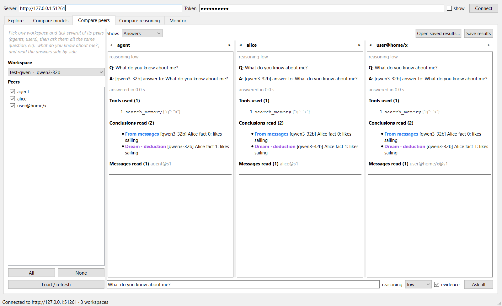
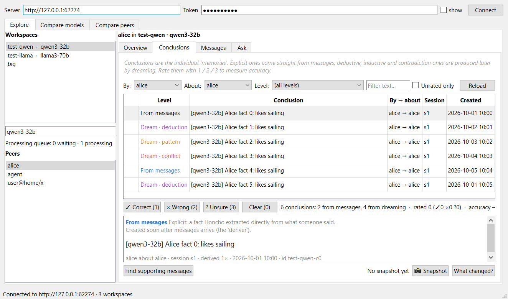
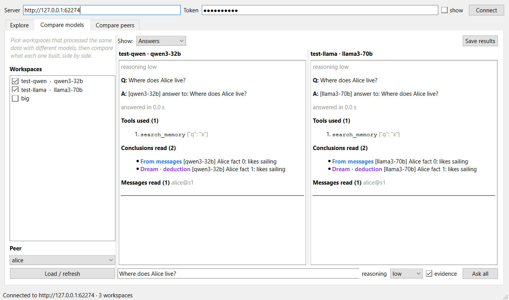
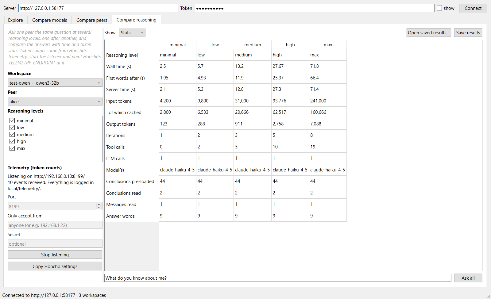
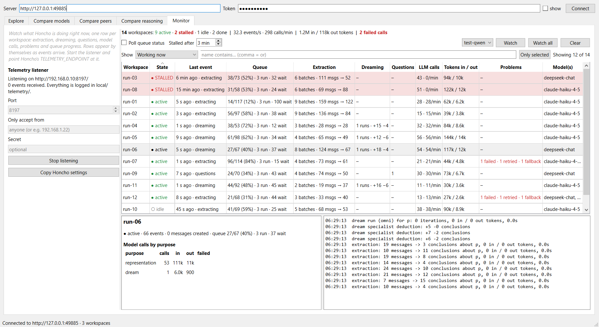
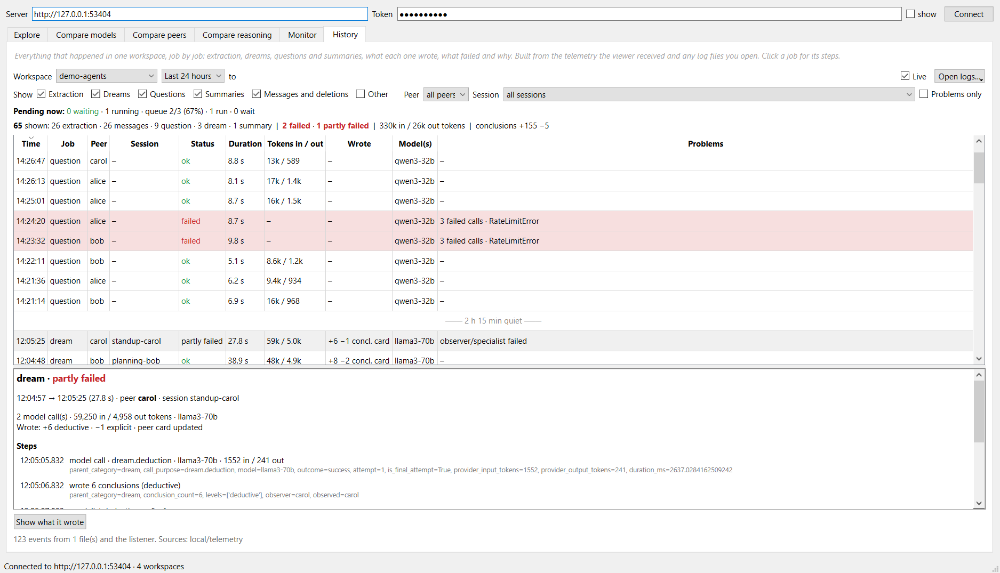

<div align="center">

# 🔍 Honcho Viewer

**A safe, read-only window into your Honcho memory server.**
Browse what it stored, ask it questions, and see what its settings and models do to the results.

[](LICENSE)


<br>



<sub>Compare peers: ask every agent the same question and read the answers side by side. (Demo data.)</sub>

</div>

> Unofficial community tool, not affiliated with Plastic Labs / [Honcho](https://honcho.dev).

## Why

Honcho builds memory from conversations in the background, which makes it hard to see what is really in it or how it
works. Honcho Viewer lets you look inside without touching the raw API or worrying about write permissions. It helps
you answer:

- 🧠 **What exactly did it conclude about this person, and from which messages?**
- ✅ **Is it right?** Rate conclusions with one key press and get an accuracy figure.
- 🌙 **What did a dream add or change?** Take a snapshot before, compare after.
- ⚖️ **What did a model or a setting change?** Put workspaces side by side to see how a different model or Honcho setting changed what it extracted.
- ⏱️ **What does a reasoning level cost?** Ask the same question at `minimal` to `max` and compare time and tokens.
- 🧑‍🤝‍🧑 **How do my agents differ?** Ask every agent "what do you know about me?" and read the answers side by side.
- 📜 **What happened, and what failed?** Every extraction, dream and question in a workspace, with its cost, what it wrote and why it failed.

## Quick start

Requires Python 3.10+.

```
git clone https://github.com/allanbell3d/honcho-viewer.git
cd honcho-viewer
pip install -r requirements.txt
python HonchoViewer.pyw          # on Windows you can also double-click HonchoViewer.pyw
```

Type your server address (for example `http://your-server:8000`, without `/docs`), paste a bearer token and
press **Connect**. Both are remembered on this PC, so you only do this once.

Prefer an installable command? `pip install .` gives you a `honcho-viewer` launcher.

## A tour

<table>
<tr>
<td width="50%"></td>
<td width="50%"></td>
</tr>
<tr>
<td align="center"><b>Explore</b><br>every conclusion, rated and traced to its messages</td>
<td align="center"><b>Compare models</b><br>the same peer across workspaces</td>
</tr>
<tr>
<td width="50%"></td>
<td width="50%"></td>
</tr>
<tr>
<td align="center"><b>Compare peers</b><br>one question, every agent</td>
<td align="center"><b>Compare reasoning</b><br>time and tokens per reasoning level</td>
</tr>
<tr>
<td colspan="2"></td>
</tr>
<tr>
<td colspan="2" align="center"><b>Monitor</b><br>watch many runs live: what each workspace is doing, its queue, tokens, problems, and which ones are stalled</td>
</tr>
<tr>
<td colspan="2"></td>
</tr>
<tr>
<td colspan="2" align="center"><b>History</b><br>every job in a workspace, what it wrote, what failed and why, down to each model call</td>
</tr>
</table>

<sub>All screenshots use made-up demo data. The times and token counts are illustrative, not benchmarks of Honcho or of any model.</sub>

| Tab | What it does |
|---|---|
| **Explore**, Overview | Peer card and representation, optionally one peer's view of another |
| **Explore**, Conclusions | Every conclusion, split into *from messages* and *from dreaming* (deductive / inductive / contradiction). Rate with keys `1` `2` `3` `0`. See the premises behind a dream conclusion, find supporting messages, and take a Snapshot to see "What changed?" after a dream |
| **Explore**, Messages | The raw conversation messages |
| **Explore**, Ask | Honcho's chat ("dialectic") endpoint with every option exposed, tooltips that explain each one, and a live preview of the exact request |
| **Compare models** | The same peer across several workspaces: counts, peer card, representation, conclusions, and one question asked to all |
| **Compare peers** | Several peers of one workspace side by side: tick the peers, ask them all the same question |
| **Compare reasoning** | One peer, the same question at several reasoning levels (`minimal` to `max`), one after another, with time, time to first words and, with live telemetry, real token counts, iterations, tool calls and models. See [live telemetry](docs/telemetry.md) |
| **Monitor** | A live table with one row per workspace that is doing something: extraction, dreaming and questions, queue progress, model calls, tokens, failed calls and retries, and a **STALLED** flag for a workspace with work waiting that has gone quiet. Rows appear by themselves as Honcho's telemetry arrives. See [live telemetry](docs/telemetry.md) |
| **History** | Everything that happened in one workspace, job by job: extraction, dreams, questions, summaries, messages and deletions, with status, tokens, what each job wrote and, for failures, every attempt and its error. Click a job for its steps. Built from the telemetry the viewer received and any log files you open |

All three Compare tabs can **Save results** (you choose where; the default is a dated, self-contained HTML page you
can open in any browser) and **Open saved results…** to bring a saved page back into the tab with all its views and
numbers, telemetry included. In Explore, **Snapshot** and **Load snapshot…** save and reload dated conclusion lists
for the "What changed?" comparison. More detail in the [user guide](docs/guide.md).

## 🔒 Read-only by design

`src/honcho_viewer/client.py` can only call an allowlist of read routes. Honcho's `POST /v3/workspaces` and
`POST .../peers` are *get-or-create*, so a typo'd ID would create data; the viewer cannot call them. The one
call that costs something is **Ask** (it runs your server's LLM), and it only happens when you press the button.
A test checks that the app never calls a route outside the allowlist.

The one thing that listens on the network is the optional **telemetry listener** (shared by Compare reasoning, Monitor and History). It is off until
you press Start, it only *receives* events that Honcho posts (it never calls back or writes to Honcho), and it can be
protected with a shared secret. Details in [docs/telemetry.md](docs/telemetry.md).

## 🏠 Your data stays on your PC

Everything the viewer saves lives in a `local/` folder in the project folder (excluded from git). If you installed
it with `pip`, it uses `~/.honcho-viewer` instead; set `HONCHO_VIEWER_HOME` to put it anywhere else.

| File | Contents |
|---|---|
| `local/settings.json` | Server address, **bearer token (plain text)**, workspace labels, window size |
| `local/ratings.json` | Your correct / wrong / unsure verdicts |
| `local/snapshots/` | Saved conclusion lists for "What changed?" |
| `local/comparisons/` | Saved Compare reports. **These contain real memory content, so don't share them.** |
| `local/telemetry/` | Every telemetry event received, in full (size-capped). **Can contain prompts and answers** |

The token is masked in the window but stored unencrypted in `settings.json`; treat that file like a password.
Memory content can be personal, so check `local/` before you zip or share the app folder.

## Tests

```
pip install -r requirements.txt pytest
python -m pytest             # offline: runs the real window against an in-process fake Honcho
python tools/smoke_test.py   # read-only check against your real server (uses the saved connection)
python tests/fake_honcho.py  # a fake server on :8765 (token: test-token) to try the app without Honcho
```

## Contributing and license

Issues and pull requests are welcome: see [CONTRIBUTING.md](CONTRIBUTING.md) and the [changelog](CHANGELOG.md).
Released under the [MIT License](LICENSE).
